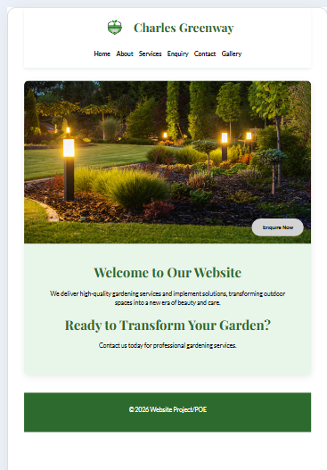
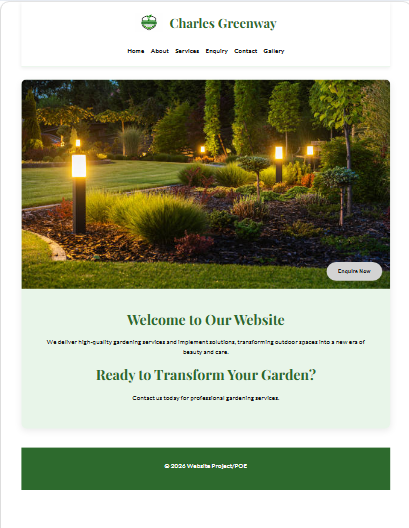
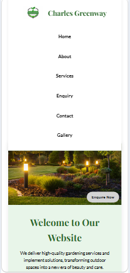

# Charles Greenway Website

## Student Information

**Student Name:** 
Imaad Charles
**Student Number:**
 ST10531353
**Module:** 
WEDE5020
**Project:** 
POE / Project Part 1, 2 and 3

---

# Project Overview

The Charles Greenway website project involves the development of a professional gardening and landscaping website for the Charles Greenway business.

The purpose of the website is to:

* Advertise gardening and landscaping services.
* Increase online awareness of the business.
* Generate new customers.
* Provide customers with information about available services and pricing.
* Allow customers to contact the business easily through multiple communication channels.

The website aims to strengthen Charles Greenway's online presence while providing a simple and user-friendly experience for customers seeking gardening and landscaping services.

The development process included:

* Project planning
* Industry research
* Content collection
* Sitemap creation
* Wireframe development
* HTML page creation
* CSS styling
* Responsive design implementation
* Website testing and refinement

The final goal is to create a visually appealing, responsive, environmentally themed website that reflects the values and services of Charles Greenway.

---

# Website Goals and Objectives

The overall goal of the Charles Greenway website is to promote gardening and landscaping services online while improving communication between the business and potential customers.

## Objectives

* Clearly display service information and pricing.
* Allow customers to submit enquiries online.
* Improve communication between customers and the business.
* Showcase available service packages.
* Build a professional online presence.
* Create a responsive website accessible on all devices.

---

# Key Performance Indicators (KPIs)

The success of the website will be measured using:

* Number of website visitors.
* Number of customer enquiries submitted.
* Growth in customer bookings.
* Customer feedback and engagement.
* Improvement in online brand visibility.

---

# Website Features and Functionality

## Homepage

### Features

* Hero banner image
* Company introduction
* Navigation menu
* Call-to-action button
* Service highlights
* Footer section

### Functionality

The homepage serves as the first point of contact and encourages users to explore the website or contact the business.

---

## About Page

### Features

* Business history
* Mission and vision
* Company values
* Team information

### Functionality

Builds trust and credibility with customers by providing background information about the business.

---

## Services Page

### Features

* Service categories
* Service descriptions
* Pricing packages
* Landscaping information
* Service-related images

### Functionality

Allows customers to compare available services and pricing options.

---

## Enquiry Page

### Features

* Online enquiry form
* Customer information fields
* Submit button

### Functionality

Allows customers to request quotations and submit enquiries directly through the website.

---

## Contact Page

### Features

* Contact details
* Phone number
* Email address
* Business location
* Google Maps integration
* Social media links

### Functionality

Provides multiple ways for customers to contact the business.

---

# Design and User Experience

The website follows a clean, modern, and environmentally friendly design style that reflects gardening, landscaping, and sustainability.

---

## Colour Palette

| Purpose          | Colour Code |
| ---------------- | ----------- |
| Primary Green    | #2E8B57     |
| Light Green      | #90EE90     |
| White Background | #FFFFFF     |
| Dark Text        | #333333     |
| Accent Colour    | #6B8E23     |

Green was selected because it represents nature, growth, freshness, and environmental sustainability.

---

## Typography

### Playfair Display

Used for:

* Hero headings
* Main page titles
* Large display text

Font size range:

* 36px – 52px

### Lato (Regular & Bold)

Used for:

* Body text
* Navigation links
* Buttons
* Captions

Font size range:

* 14px – 24px

### Lato Bold

Used for:

* H2 and H3 headings
* Section titles
* Service cards

Font size range:

* 18px – 28px

---

# Technical Requirements

## Infrastructure and Hosting

The website is developed using:

* HTML5
* CSS3
* JavaScript
* Visual Studio Code
* GitHub

Hosting requirements include:

* Reliable uptime
* HTTPS support
* Domain registration
* Website backups

---

## Performance and Accessibility

The website has been optimised through:

* Responsive design
* Image optimisation
* Readable typography
* Alternative image text
* Mobile-friendly layouts
* Improved loading performance

---

## Security and Compliance

Security measures include:

* HTTPS encryption
* Spam protection
* Secure form handling
* Customer information protection
* POPIA compliance

---

## Functional Integrations

Current and future integrations include:

* Google Maps
* Email enquiry forms
* Social media links
* WhatsApp contact button

---

## Ongoing Maintenance

Maintenance activities include:

* Updating pricing information
* Updating content
* Fixing broken links
* Website optimisation
* Security checks
* Monitoring customer feedback

---

# Content Research and Sourcing

## Research Overview

Research was conducted to gather accurate and relevant information for the Charles Greenway website.

The purpose of the research was to ensure that all content presented on the website is professional, informative, and aligned with the gardening and landscaping industry.

---

## Sources Used

* Charles Greenway Business Plan
* Royal Horticultural Society
* Encyclopaedia Britannica
* HomeAdvisor
* Fixr
* Gardening and landscaping industry resources
* Public domain image libraries
* Website design inspiration sources

---

## Content Collected

Research was used to gather:

* Gardening service descriptions
* Landscaping information
* Pricing structures
* Business information
* Website content ideas
* Design inspiration
* Customer service concepts
* Branding and marketing ideas

---

## Content Allocation by Page

### Homepage

* Business introduction
* Hero banner
* Service highlights
* Call-to-action content

### About Page

* Business history
* Mission and vision
* Company values
* Team information

### Services Page

* Service descriptions
* Pricing packages
* Service categories
* Gardening imagery

### Enquiry Page

* Customer enquiry form
* Quote request information

### Contact Page

* Contact details
* Location information
* Social media links
* Interactive map

---

# Sitemap

!

---

# Wireframes

## Desktop Wireframe

> Insert desktop wireframe image here.

## Desktop Responsive Screenshot

## Tablet Responsive Screenshot

> Insert tablet wireframe image here.

## Mobile Phone Responsive Screenshot

> Insert mobile wireframe image here.

!
 Resources Used

| Resource           | Source          |
| ------------------ | --------------- |
| Hero Banner        | iStock / Pexels |
| Gardening Images   | Pexels          |
| Landscaping Images | Unsplash        |
| Service Images     | Pexels          |

---

## Icons

* Font Awesome
* Navigation Icons
* Contact Icons
* Social Media Icons

---

## Fonts

* Playfair Display
* Lato

---

# Project Timeline

| Week   | Task                             |
| ------ | -------------------------------- |
| Week 1 | Planning and proposal            |
| Week 2 | Content collection and research  |
| Week 3 | Website structure and sitemap    |
| Week 4 | HTML development                 |
| Week 5 | Navigation and linking           |
| Week 6 | Styling and responsiveness       |
| Week 7 | Forms and functionality          |
| Week 8 | Testing and improvements         |
| Week 9 | Final corrections and submission |

---

# Changelog

| Date          | Update                                                  |
| ------------- | ------------------------------------------------------- |
| 10 April 2026 | Initial project proposal created                        |
| 14 April 2026 | Added website goals and objectives                      |
| 16 April 2026 | Improved proposal presentation and structure            |
| 18 April 2026 | Added detailed website features and functionalities     |
| 20 April 2026 | Added explanations of content for each page             |
| 22 April 2026 | Added colour palette and typography                     |
| 24 April 2026 | Improved design and user experience                     |
| 26 April 2026 | Added technical requirements                            |
| 28 April 2026 | Added Infrastructure & Hosting section                  |
| 30 April 2026 | Added Performance & Accessibility section               |
| 2 May 2026    | Added Security & Compliance section                     |
| 4 May 2026    | Added Functional Integrations section                   |
| 6 May 2026    | Added Ongoing Maintenance section                       |
| 8 May 2026    | Added Content Research and Sourcing section             |
| 10 May 2026   | Recreated README structure                              |
| 12 May 2026   | Improved references and citations                       |
| 15 May 2026   | Started responsive wireframe development                |
| 18 May 2026   | Final proposal formatting improvements                  |
| 20 May 2026   | Developed initial CSS structure and reset system        |
| 22 May 2026   | Implemented colour system and global styling            |
| 24 May 2026   | Styled navigation, hero sections, buttons, and forms    |
| 26 May 2026   | Improved responsive layouts using media queries         |
| 28 May 2026   | Completed final CSS refinements and UI improvements     |
| 29 May 2026   | Added content research documentation to README          |
| 29 May 2026   | Added website screenshot documentation sections         |
| 29 May 2026   | Added image and asset documentation                     |
| 29 May 2026   | Updated README formatting for professional presentation |
| 17 June 2026   | Updated README formatting for professional presentation
| 17 May 2026   | and added content and reserch to proposal  |
| Date        | Description                                                                                                                      |
| ----------- | -------------------------------------------------------------------------------------------------------------------------------- |
| 16 June 2026 | Reviewed Part 2 feedback and implemented corrections to styling consistency, responsive layouts, navigation usability, accessibility, and overall user experience |
| 16 June 2026 | Refined CSS structure and optimised page layouts to improve maintainability, readability, and visual consistency across the website |
| 17 June 2026 | Created and linked external JavaScript files to add dynamic functionality and enhance website interactivity |
| 17 June 2026 | Implemented responsive hamburger menu navigation for tablet and mobile devices using JavaScript and CSS |
| 17 June 2026 | Added interactive navigation functionality including menu toggling, active states, and improved mobile accessibility |
| 17 June 2026 | Added CSS animations, transitions, and hover effects to buttons, navigation links, gallery items, and call-to-action sections |
| 17 June 2026 | Embedded multiple Google Maps locations on the Contact page to provide location-based information and improve customer accessibility |
| 17 June 2026 | Created interactive image gallery using JavaScript DOM manipulation to dynamically manage and display gallery content |
| 17 June 2026 | Added lightbox functionality allowing images to open in enlarged view with next and previous navigation controls |
| 17 June 2026 | Fixed gallery JavaScript to correctly use existing HTML images instead of dynamically generating broken image paths |
| 17 June 2026 | Implemented advanced DOM manipulation techniques to dynamically update website content and improve user interaction |
| 18 June 2026 | Added dynamic content functionality using JavaScript to update website content without requiring page refreshes |
| 18 June 2026 | Implemented AJAX functionality for asynchronous form processing and improved user experience during form submissions |
| 18 June 2026 | Added service search and filtering functionality allowing users to quickly locate relevant services on the website |
| 18 June 2026 | Built enquiry form with HTML form controls including text fields, email fields, phone inputs, dropdown menus, text areas, and submit buttons |
| 18 June 2026 | Added JavaScript validation for enquiry form including required field checks, email verification, phone number validation, character limits, and error handling |
| 18 June 2026 | Implemented enquiry processing functionality providing users with immediate feedback regarding service availability and enquiry submissions |
| 18 June 2026 | Developed contact form with customer information fields, message categories, subject selection, and detailed message submission functionality |
| 18 June 2026 | Added JavaScript contact form validation with required field checks, input verification, format validation, and user-friendly error messages |
| 18 June 2026 | Implemented contact form email functionality allowing users to send validated messages directly to the business email address |
| 18 June 2026 | Implemented dynamic footer JavaScript displaying the current date and year automatically across all website pages |
| 18 June 2026 | Performed testing and debugging of all JavaScript functionality to ensure reliable performance across all website pages |
| 19 June 2026 | Added SEO title tags to all website pages using page-specific keywords and optimised page titles |
| 19 June 2026 | Created and optimised meta descriptions for all website pages to improve search engine visibility and click-through rates |
| 19 June 2026 | Added relevant meta keywords relating to gardening, landscaping, lawn care, garden maintenance, and outdoor services |
| 19 June 2026 | Improved heading structure using H1, H2, and H3 tags to enhance content hierarchy and SEO performance |
| 19 June 2026 | Added descriptive image file names and alt text to all website images to improve accessibility and search engine indexing |
| 19 June 2026 | Improved internal linking structure between pages to strengthen navigation and search engine crawlability |
| 19 June 2026 | Created clean and descriptive URL structure to improve usability and search engine optimisation |
| 19 June 2026 | Created robots.txt file to guide search engine crawlers and improve website indexing management |
| 19 June 2026 | Created sitemap.xml file containing all website pages to improve search engine discovery and indexing |
| 19 June 2026 | Optimised website for SEO by structuring pages for indexing, improving crawlability, and enhancing mobile friendliness |
| 19 June 2026 | Optimised website performance through image optimisation, efficient CSS organisation, compressed assets, and removal of unnecessary code |
| 19 June 2026 | Conducted cross-browser compatibility testing to ensure consistent functionality across modern web browsers |
| 19 June 2026 | Performed responsive testing across desktop, tablet, and mobile screen sizes to verify optimal user experience |
| 19 June 2026 | Deployed the completed Charles Greenway website to Netlify and tested all pages, forms, navigation links, search features, maps, and media content in the live environment |
| 19 June 2026 | Updated README.md with Part 3 functionality details, deployment information, SEO implementation details, references, screenshots, and complete project changelog |                                         |

---

# References

Charles, I. (2023). *Business Plan: Charles Greenway*. Unpublished internal document.

Royal Horticultural Society (2024). *Garden Maintenance*.

Encyclopaedia Britannica (2024). *Gardening*.

HomeAdvisor (2024). *Landscaping Costs*.

Fixr (2024). *Average Landscaping Costs*.

OpenAI (2024). *Charles Greenway Gardening Logo*.

iStock (2024). *Contemporary Garden Stock Photos*.

